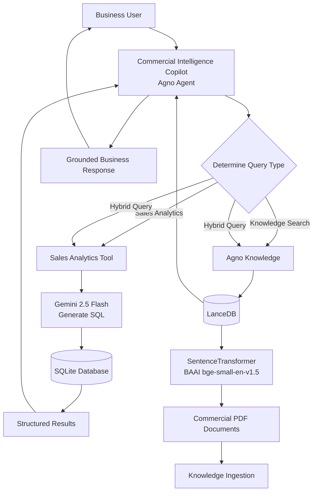
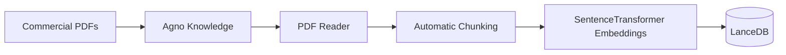
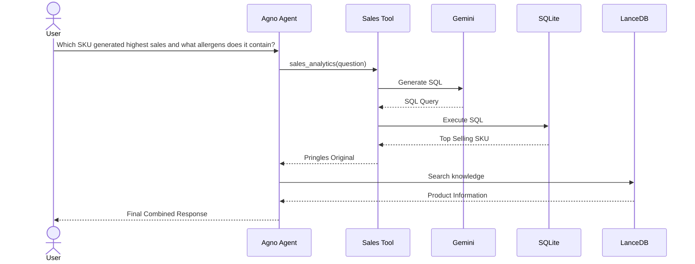

# Commercial-Intelligence-Copilot-RETAIL-GPT-
An Agentic AI assistant for FMCG Commercial Analytics. 
Features:
SQL Analytics
Enterprise RAG
Tool Calling
Hybrid Retrieval
Agno Agent
LanceDB
Gemini Architecture

## 🏗️ System Architecture
                    Business User
                          │
                          ▼
        ┌─────────────────────────────────┐
        │  Commercial Intelligence Agent  │
        │             (Agno)              │
        └───────────────┬─────────────────┘
                        │
        ┌───────────────┴────────────────┐
        │                                │
        ▼                                ▼
 ┌───────────────┐              ┌────────────────┐
 │ Sales Tool    │              │ Knowledge API  │
 └──────┬────────┘              └──────┬─────────┘
        │                              │
        ▼                              ▼
 ┌───────────────┐              ┌────────────────┐
 │ Gemini SQL    │              │ LanceDB        │
 │ Generation    │              │ Vector Store   │
 └──────┬────────┘              └──────┬─────────┘
        │                              │
        ▼                              ▼
 ┌───────────────┐              ┌────────────────┐
 │ SQLite        │              │ Commercial PDFs│
 │ Sales DB      │              │ + Embeddings   │
 └───────────────┘              └────────────────┘

## 📚 Knowledge Ingestion Pipeline

## 🚀 Runtime Query Flow

