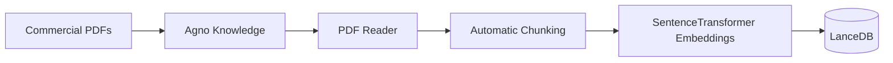
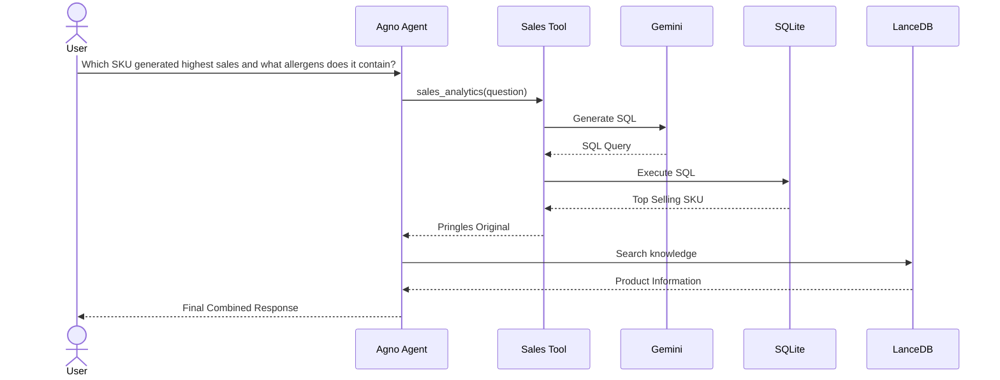

# Commercial-Intelligence-Copilot-RETAIL-GPT-
An Agentic AI assistant for FMCG Commercial Analytics. 
Features:
SQL Analytics
Enterprise RAG
Tool Calling
Hybrid Retrieval
Agno Agent
LanceDB
Gemini Architecture

## 🏗️ System Architecture
## System Architecture

                    Commercial Intelligence Copilot

                           Business User
                                  │
                                  ▼
                  ┌─────────────────────────┐
                  │     Agno AI Agent       │
                  └──────────┬──────────────┘
                             │
             ┌───────────────┴────────────────┐
             │                                │
             ▼                                ▼
    Sales Analytics Tool             Agno Knowledge
             │                                │
             ▼                                ▼
     Gemini SQL Generator               LanceDB
             │                                ▲
             ▼                                │
        SQLite Database          SentenceTransformer
                                               ▲
                                               │
                                       Commercial PDFs

## 📚 Knowledge Ingestion Pipeline

## 🚀 Runtime Query Flow

