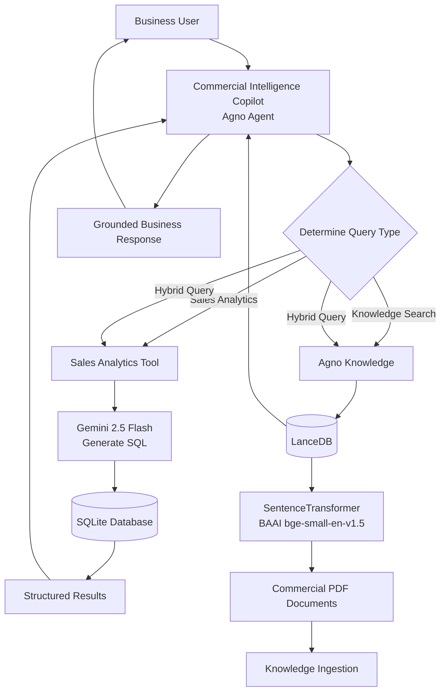

# Commercial-Intelligence-Copilot-RETAIL-GPT-
An Agentic AI assistant for FMCG Commercial Analytics.  Features  ✓ SQL Analytics  ✓ Enterprise RAG  ✓ Tool Calling  ✓ Hybrid Retrieval  ✓ Agno Agent  ✓ LanceDB  ✓ Gemini  Architecture

## 🏗️ System Architecture

